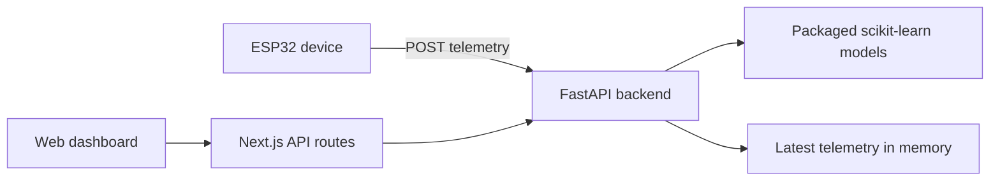

<div align="center">

# THERMA

### Heat-strain monitoring, from sensor readings to a clear interface.

A research prototype combining a web dashboard, physiological anomaly detection, and ESP32 telemetry support.

**Next.js · TypeScript · FastAPI · scikit-learn**

[Local setup](#local-setup-development-only) · [Architecture](#architecture) · [Documentation](#documentation)

</div>

---

## Overview

Therma brings physiological readings and model outputs into one dashboard. It includes desktop and mobile views, a standard prediction endpoint, a personalized anomaly analysis flow, and an API that accepts sensor readings from an ESP32.

The backend runs packaged scikit-learn models locally. No hosted AI service or API key is required for inference. Existing deployment documents also refer to this prototype as **RESILIO**.

## Capabilities

| Area | Implementation |
| --- | --- |
| Dashboard | Desktop entry point and dedicated mobile interface |
| Anomaly analysis | Standard and seven-feature personalized prediction APIs |
| Device readings | ESP32 telemetry ingestion with latest-reading retrieval |
| Connection state | Reading age and a ten-second freshness threshold |
| Integration | Next.js server routes proxy requests to FastAPI |

## Architecture



## Local setup (development only)

> **These instructions run Therma on your own computer.** `localhost` and `127.0.0.1` refer to the computer you are using, not a public website or hosted demo. The addresses below work only after you start the corresponding local servers.

Use **Node.js 22** and **Python 3.12**. The commands below are for PowerShell.

```powershell
git clone https://github.com/Azhika/therma-heat-strain-dashboard.git
cd therma-heat-strain-dashboard
```

### 1. Start the backend

From the repository root:

```powershell
cd backend
py -3.12 -m venv .venv
.\.venv\Scripts\python.exe -m pip install -r requirements.txt
.\.venv\Scripts\python.exe -m uvicorn api:app --reload
```

After starting the backend, open the **local API documentation** at `http://127.0.0.1:8000/docs` on the same computer.

### 2. Start the dashboard

Open a second terminal at the repository root:

```powershell
npm ci
Copy-Item .env.example .env.local
npm run dev
```

After starting the dashboard, open `http://localhost:3000` for the desktop entry point or `http://localhost:3000/mobile` for the mobile interface **on your own computer**. These are local development addresses, not public demo links. The supplied environment example connects to the local backend on port 8000.

For hosting the application online, see the [Deployment guide](DEPLOYMENT.md).

### Development commands

```powershell
npm run lint
npm run build
```

## Prototype scope

- Demo scenarios and the personalized example fixture are distinct from live hardware readings. ESP32 firmware and a recorded-dataset replay controller are not included.
- Telemetry storage holds one latest frame in process memory. It resets on restart and is not a persistent history or a per-device store.
- Training scripts and model evaluation results are not included in this repository.
- This prototype performs physiological anomaly detection; it is not a medical diagnostic system.

## Documentation

| Guide | Contents |
| --- | --- |
| [Deployment](DEPLOYMENT.md) | Frontend and backend hosting configuration |
| [ESP32 telemetry](ESP32-TELEMETRY.md) | Device payloads and telemetry integration |
| [Personalized analysis](PERSONALIZED-AI.md) | Feature derivation and example analysis flow |
| [Backend](backend/README.md) | Runtime files and API deployment |

## Next steps

- Add a recorded walkthrough and dashboard screenshots.
- Commit automated API and interface tests with continuous integration.
- Document model provenance, training, and evaluation.
- Add device authentication and persistent telemetry storage.